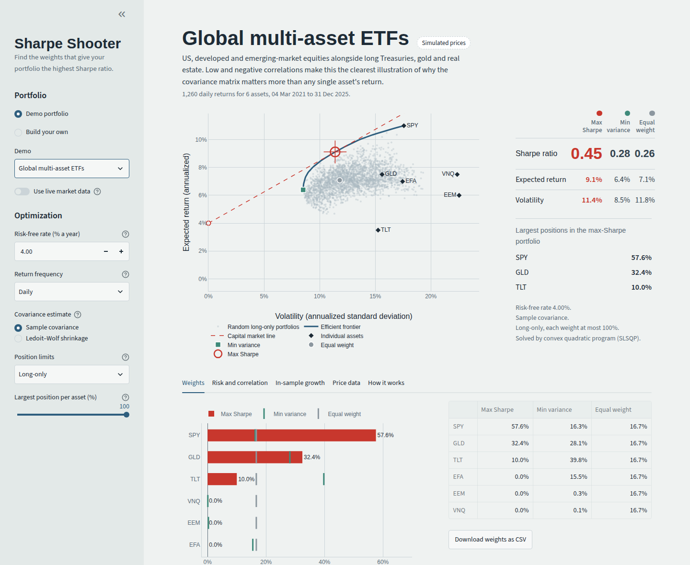

# Sharpe Shooter

Sharpe Shooter takes a portfolio of equities (or any assets with a price history) and finds the weights that give the whole portfolio the highest possible **Sharpe ratio**. It uses:

- the historical returns of each asset,
- their **covariance matrix**,
- and your choice of risk-free rate and position limits.

It comes with three demo portfolios that work offline. You can also build your own from Yahoo Finance, Alpha Vantage, Tiingo or a CSV file.



---

## Contents

1. [Quick start](#1-quick-start)
2. [Project layout](#2-project-layout)
3. [Navigating the UI](#3-navigating-the-ui)
4. [Building your own portfolio with APIs](#4-building-your-own-portfolio-with-apis)
5. [The maths](#5-the-maths)
6. [Using the optimizer from Python](#6-using-the-optimizer-from-python)
7. [Troubleshooting](#7-troubleshooting)
8. [Disclaimer](#8-disclaimer)

---

## 1. Quick start

You need **Python 3.10 or newer**.

```bash
cd sharpe-shooter

# Create and activate a virtual environment (recommended)
python -m venv .venv
source .venv/bin/activate          # Windows: .venv\Scripts\activate

# Install dependencies
pip install -r requirements.txt

# Launch the app
streamlit run app.py
```

Streamlit opens the app in your browser at **http://localhost:8501**. If it doesn't, open that address yourself. Stop the app with `Ctrl+C` in the terminal.

The app opens on the **Big Tech** demo, so you see a fully optimized portfolio straight away without any API keys or internet connection.

### Running the tests

```bash
pip install -r requirements-dev.txt
pytest -q
```

The 17 tests check the maths:

- The closed-form and numerical solutions agree.
- The optimizer beats 200,000 random portfolios.
- Weight caps are respected.
- The Ledoit–Wolf estimator matches scikit-learn's.

They also check error handling, and they check each data provider against mocked API responses, so no network is needed.

---

## 2. Project layout

```
sharpe-shooter/
├── app.py                        # The Streamlit UI (run this)
├── requirements.txt              # Runtime dependencies
├── requirements-dev.txt          # + pytest and scikit-learn for the tests
├── .streamlit/
│   ├── config.toml               # Colors, fonts and layout theme
│   └── secrets.toml.example      # Template for storing API keys
├── sharpe_shooter/
│   ├── estimators.py             # Prices → returns, annualization, covariance estimators
│   ├── optimizer.py              # Max-Sharpe, min-variance, efficient frontier
│   ├── providers.py              # Yahoo Finance, Alpha Vantage, Tiingo, CSV upload
│   ├── demo.py                   # The three demo portfolios (simulated prices)
│   ├── performance.py            # In-sample growth, drawdown and statistics
│   └── charts.py                 # Plotly figures
├── examples/sample_prices.csv    # Example of the CSV upload format
├── docs/screenshot.png
└── tests/test_sharpe_shooter.py
```

The maths lives entirely in `sharpe_shooter/`, which has no dependency on Streamlit. You can import it into a notebook or script (see [section 6](#6-using-the-optimizer-from-python)).

---

## 3. Navigating the UI

The screen has two parts:

- **The sidebar on the left** is where you choose a portfolio and set up the optimization.
- **The main area on the right** shows the result.

Every control updates the result immediately. The only exception is fetching prices from an API, which waits until you press **Fetch prices**.

### 3.1 Sidebar: Portfolio

Choose **Demo portfolio** or **Build your own**.

**Demo portfolio** offers three built-in portfolios:

| Demo | Assets | What it illustrates |
|---|---|---|
| **Big Tech** | AAPL, MSFT, GOOGL, AMZN, NVDA, META | Highly correlated, high-volatility stocks. Diversification is limited, so the optimizer concentrates on a few names. |
| **Diversified blue chips** | JNJ, PG, KO, WMT, JPM, XOM, CAT | Defensive and cyclical sectors that move differently, giving the covariance matrix more to work with. |
| **Global multi-asset ETFs** | SPY, EFA, EEM, TLT, GLD, VNQ | Equities plus Treasuries, gold and real estate. The low and negative correlations make this the clearest demonstration of why covariance matters. |

The demo prices are **simulated** so the app works offline. The badge next to the title says "Simulated prices" as a reminder.

Each asset is given a realistic long-run return, volatility and correlation structure. Daily returns are then drawn from a fat-tailed (Student-t) distribution, using a two-factor model: a market factor plus a sector factor. The parameters are in `sharpe_shooter/demo.py`.

Turn on **Use live market data** to run the same tickers on real Yahoo Finance prices. A slider then lets you choose how many years of history to use.

**Build your own** lets you pick a data source and enter tickers. See [section 4](#4-building-your-own-portfolio-with-apis).

### 3.2 Sidebar: Optimization

| Setting | What it does | Suggested starting point |
|---|---|---|
| **Risk-free rate (% a year)** | The return on a riskless asset. The Sharpe ratio measures return *above* this. | The current 3-month Treasury bill yield (US) or gilt/SONIA rate (UK). The default is 4%. |
| **Return frequency** | Samples prices daily, weekly or monthly before computing returns. Annualization adjusts automatically (252, 52 or 12 periods a year). | Daily for US-only portfolios. Weekly when mixing markets in different time zones, because their closing prices aren't simultaneous. |
| **Covariance estimate** | **Sample covariance** is the textbook estimator. **Ledoit–Wolf shrinkage** blends it with a simple structured target, which reduces noise ([§5.5](#55-ledoitwolf-shrinkage)). | Ledoit–Wolf, especially with many assets or a short history. |
| **Position limits** | **Long-only**: no negative weights. **Long and short**: weights between −cap and +cap. **Unconstrained**: any weights, solved in closed form. | Long-only is how most people actually invest. |
| **Largest position per asset (%)** | Caps every weight. Its minimum is 100 ÷ (number of assets), because the weights must still reach 100%. | 100% (no cap), then try 30–40% to force diversification. |

### 3.3 Main area: header

The header shows:

- the portfolio name,
- a badge showing where the data came from,
- how many returns were used and over which dates.

A blue information box appears if anything needs your attention. Examples are a ticker that was skipped, a short price history that truncated the others, or a covariance matrix that is close to singular.

### 3.4 Main area: the efficient frontier chart

This chart is the heart of the app. Hover over any point to see its numbers. Drag to zoom, and double-click to reset.

| Element | Meaning |
|---|---|
| **Grey dots** | Thousands of random long-only portfolios, to show what's possible. |
| **Blue curve** | The **efficient frontier**: the lowest-volatility portfolio for each level of expected return, under your position limits. |
| **Black diamonds** | Each individual asset. |
| **Teal square** | The **minimum-variance** portfolio, the far-left tip of the frontier. |
| **Grey circle** | The **equal-weight** portfolio, for comparison. |
| **Red open circle at 0% volatility** | The risk-free rate. |
| **Red dashed line** | The **capital market line**, from the risk-free rate through the optimal portfolio. Its slope is the Sharpe ratio. |
| **Red crosshair** | The **maximum-Sharpe portfolio**: the point where the steepest possible line from the risk-free rate just touches the frontier. |

Red is reserved for the optimal portfolio throughout the app, so anything red refers to it.

### 3.5 Main area: the readout

The panel to the right of the chart compares three portfolios side by side: **Max Sharpe**, **Min variance** and **Equal weight**. For each it shows the Sharpe ratio, expected return and volatility.

Below that, it lists the largest positions in the optimal portfolio. Short positions appear as negative numbers.

At the bottom, it summarizes the settings used and which solver found the answer.

### 3.6 Main area: tabs

| Tab | Contents |
|---|---|
| **Weights** | A bar chart of the optimal weights, with tick marks for the min-variance and equal-weight portfolios. Also a table of all three and a **Download weights as CSV** button. |
| **Risk and correlation** | Each asset's expected return, volatility, Sharpe ratio and optimal weight. A **correlation heatmap** (blue = move together, ochre = move apart). A chart comparing each asset's **share of capital** with its **share of risk** ([§5.10](#510-risk-contributions)). An expander containing the full **annualized covariance matrix** the optimizer used. |
| **In-sample growth** | What 1 unit invested in each portfolio would have grown to, with total return, CAGR, volatility, realized Sharpe and maximum drawdown. These weights were chosen with hindsight, so read this as a description of the past, not a forecast. |
| **Price data** | All prices rebased to 1, the raw price table, and CSV downloads of prices and returns. |
| **How it works** | A short version of the maths in section 5. |

---

## 4. Building your own portfolio with APIs

In the sidebar choose **Build your own**, then pick a **Data source**:

1. Enter a portfolio name and your tickers, separated by commas or spaces.
2. Choose a date range.
3. Enter an API key if the source needs one.
4. Press **Fetch prices**.

Fetched prices are cached for an hour, so changing the optimization settings afterwards doesn't call the API again.

Tickers the provider doesn't recognize are skipped with a note, and the rest still load. If the tickers have different start dates, every asset is analyzed from the latest start date. This keeps the covariance matrix consistent, because every covariance must be measured over the same dates.

### 4.1 Yahoo Finance (no key)

- Works immediately, using the [`yfinance`](https://github.com/ranaroussi/yfinance) library.
- Returns daily prices adjusted for splits and dividends.
- Use Yahoo's own symbols:
  - `BRK-B`, not `BRK.B`
  - an exchange suffix for non-US listings, such as `VOD.L`, `HSBA.L` or `AZN.L` (London), `SAP.DE` (Xetra) or `7203.T` (Tokyo)
  - index or other funds as listed, e.g. `^GSPC`
- London prices are quoted in pence. That doesn't matter here, because only percentage returns are used.
- `yfinance` is an unofficial library and Yahoo occasionally changes its site. If downloads start failing, `pip install -U yfinance` usually fixes it.

### 4.2 Alpha Vantage (free key)

1. Get a free key at <https://www.alphavantage.co/support/#api-key>.
2. Paste it into the **Alpha Vantage API key** field, or store it as shown in [§4.4](#44-storing-api-keys).
3. Choose **Weekly** or **Monthly** in the Interval box.

At the time of writing, Alpha Vantage's free tier offers split- and dividend-adjusted prices at weekly and monthly frequency. The app uses those, because unadjusted daily prices would turn every stock split into a fake crash. Selecting **Daily** under Return frequency with Alpha Vantage data falls back to the data's native frequency, and the app tells you so.

The free tier allows roughly **25 requests a day**, and each ticker is one request. If you hit the limit, the app shows Alpha Vantage's message and stops.

### 4.3 Tiingo (free key)

1. Get a free key at <https://www.tiingo.com/account/api/token>.
2. Paste it into the **Tiingo API key** field, or store it as shown in [§4.4](#44-storing-api-keys).

Tiingo returns daily adjusted prices for US stocks, ETFs and mutual funds. Its free tier has hourly and daily request limits, which are generous for this use.

### 4.4 Storing API keys

So you don't have to paste keys every time, the app pre-fills the key field from either of these (the first one found wins):

**Option 1: Streamlit secrets file**

```bash
cp .streamlit/secrets.toml.example .streamlit/secrets.toml
```

Then edit `.streamlit/secrets.toml`:

```toml
ALPHAVANTAGE_API_KEY = "your-key"
TIINGO_API_KEY = "your-key"
```

This file is git-ignored.

**Option 2: environment variables**

```bash
export ALPHAVANTAGE_API_KEY="your-key"     # Windows PowerShell: $env:ALPHAVANTAGE_API_KEY="your-key"
export TIINGO_API_KEY="your-key"
streamlit run app.py
```

### 4.5 Uploading a CSV

Choose **Upload a CSV** as the data source. The file must be in "wide" format:

- the **first column is dates**,
- then **one column per ticker**.

```csv
Date,SPY,EFA,EEM,TLT,GLD,VNQ
2023-02-07,100.00,100.00,100.00,100.00,100.00,100.00
2023-02-08,102.16,101.25,99.43,100.94,102.14,103.21
...
```

- Set **The numbers in the file are** to **prices** or **returns**. Returns should be decimals (0.01 = 1%). If they look like percentages, the app divides them by 100 and says so.
- Any date format pandas can read is accepted.
- Blank cells are allowed; rows where any asset is missing are dropped.
- The sidebar has a **Download an example CSV** link, the same file as `examples/sample_prices.csv`. Note that it contains simulated prices.

### 4.6 Adding another data provider

Every provider has one job: turn a list of tickers and a date range into a DataFrame of adjusted closing prices. To add one, subclass `PriceProvider` in `sharpe_shooter/providers.py` and implement `fetch_one`:

```python
class MyVendorProvider(PriceProvider):
    name = "My vendor"                         # shown in the Data source dropdown
    needs_api_key = True
    key_env_var = "MYVENDOR_API_KEY"           # pre-fills the key field
    signup_url = "https://example.com/api-keys"
    notes = "One line shown under the form in the sidebar."

    def fetch_one(self, ticker, start, end, api_key, **options) -> pd.Series:
        resp = requests.get(
            f"https://api.example.com/eod/{ticker}",
            params={"from": start.isoformat(), "to": end.isoformat(), "key": api_key},
            timeout=30,
        )
        if resp.status_code == 404:
            raise DataProviderError("symbol not found")   # skipped; other tickers still load
        rows = resp.json()
        return pd.Series({pd.Timestamp(r["date"]): float(r["adj_close"]) for r in rows})
```

Then add `MyVendorProvider()` to the `PROVIDERS` tuple at the bottom of the file, and it appears in the UI.

Errors are handled in two ways:

- **Skip one ticker:** raise `DataProviderError`. That ticker is skipped with a note, and the rest still load.
- **Stop the whole fetch:** raise `_fatal(...)` instead. Use this for problems such as a bad key or a rate limit.

Options you list in the class's `options` dict appear as dropdowns and are passed to `fetch_one` as keyword arguments.

---

## 5. The maths

### 5.1 From prices to returns

For each asset $i$ with prices $P_{i,t}$, the app uses **simple (arithmetic) returns**:

$$
r_{i,t} = \frac{P_{i,t}}{P_{i,t-1}} - 1
$$

Simple returns are used, rather than log returns, because a portfolio's simple return is exactly the weighted sum of its assets' simple returns:

$$
r_{p,t} = \sum_i w_i\, r_{i,t} = w^\top r_t
$$

Prices should be adjusted for splits and dividends, which all the providers do, so each return is a total return.

### 5.2 Annualization

Let $P$ be the number of periods per year (252 daily, 52 weekly, 12 monthly). Treating returns as independent from period to period:

$$
\mu^{\text{annual}} = P\,\bar r, \qquad
\Sigma^{\text{annual}} = P\,\Sigma^{\text{periodic}}, \qquad
\sigma^{\text{annual}} = \sqrt{P}\,\sigma^{\text{periodic}}
$$

Means and variances grow linearly with time, so volatility grows with the square root of time. Everything shown in the app is annualized, so results are comparable across frequencies.

### 5.3 Expected returns

The expected return vector $\mu \in \mathbb{R}^N$ is the historical arithmetic mean of each asset's returns, annualized:

$$
\mu_i = P \cdot \frac{1}{T}\sum_{t=1}^{T} r_{i,t}
$$

This is the simplest possible estimate, and also the noisiest input to the whole problem ([§5.11](#511-limitations-read-this)).

### 5.4 The covariance matrix

The covariance matrix $\Sigma \in \mathbb{R}^{N\times N}$ describes how the assets move **together**.

- Its diagonal entries are the variances $\sigma_i^2$.
- Its off-diagonal entries are the covariances $\sigma_{ij} = \rho_{ij}\,\sigma_i\sigma_j$, where $\rho_{ij}$ is the correlation between assets $i$ and $j$.

The unbiased sample estimate is:

$$
\hat\Sigma = \frac{P}{T-1}\sum_{t=1}^{T}(r_t - \bar r)(r_t - \bar r)^\top
$$

**Why it matters.** The variance of a portfolio depends on every pair of assets, not just on each asset alone:

$$
\sigma_p^2 = w^\top \Sigma\, w = \sum_i w_i^2\sigma_i^2 + \sum_{i\neq j} w_i w_j\,\rho_{ij}\,\sigma_i\sigma_j
$$

Take two assets, each with 20% volatility, held 50/50:

| Correlation | Portfolio volatility |
|---|---|
| $\rho = 1$ | 20% |
| $\rho = 0$ | 14.1% |
| $\rho = -0.5$ | 10% |
| $\rho = -1$ | 0% |

The expected return is identical in all three cases. The volatility is not. This is diversification, and it is why the optimizer can often find portfolios with a higher Sharpe ratio than *any* individual asset.

### 5.5 Ledoit–Wolf shrinkage

With $N$ assets the covariance matrix has $N(N+1)/2$ distinct entries. That is 21 for 6 assets and 210 for 20, all estimated from the same limited history.

The sample estimate is unbiased but noisy. The noise also isn't harmless: the optimizer effectively inverts $\Sigma$, so it treats spurious low correlations as genuine diversification opportunities. The result is extreme, unstable weights.

Ledoit and Wolf (2004) propose pulling the sample matrix $S$ towards a simple, well-behaved target $F = m\,I$, where $m = \operatorname{tr}(S)/N$ is the average variance:

$$
\hat\Sigma_{\text{LW}} = (1-\delta)\,S + \delta\, m\, I
$$

The shrinkage intensity $\delta \in [0,1]$ is chosen to minimize the expected squared error, and can be estimated from the data. Let $x_t$ be the demeaned return vectors and $S = \frac1T\sum_t x_t x_t^\top$. Then:

$$
d^2 = \frac{\lVert S - mI\rVert_F^2}{N}, \qquad
\bar b^2 = \frac{1}{T^2}\sum_{t=1}^{T}\frac{\lVert x_t x_t^\top - S\rVert_F^2}{N}, \qquad
\delta^\ast = \frac{\min(\bar b^2,\, d^2)}{d^2}
$$

- $d^2$ measures how far the sample matrix is from the target.
- $\bar b^2$ measures how noisy the sample matrix is.

The noisier the estimate relative to the gap, the harder it is shrunk. The readout panel shows the shrinkage used, for example "Ledoit–Wolf shrinkage (6% shrinkage)". The implementation in `estimators.py` is checked against scikit-learn's in the test suite.

### 5.6 Portfolio return, risk and the Sharpe ratio

For weights $w$ with $\mathbf 1^\top w = 1$ (fully invested):

$$
\mu_p = w^\top\mu, \qquad
\sigma_p = \sqrt{w^\top\Sigma\,w}, \qquad
S(w) = \frac{w^\top\mu - r_f}{\sqrt{w^\top\Sigma\,w}}
$$

The **Sharpe ratio** is excess return per unit of volatility. It answers the question: how much am I paid above the risk-free rate for each unit of risk I take?

It is the natural quantity to maximize for a simple reason. If you can also lend or borrow at $r_f$, then *any* target level of risk is best reached by holding the maximum-Sharpe portfolio and mixing it with cash or leverage. Those mixtures trace out the capital market line (§5.9).

### 5.7 The unconstrained solution: the tangency portfolio

Define the excess return vector $e = \mu - r_f\mathbf 1$. Because $\mathbf 1^\top w = 1$, we can write $w^\top\mu - r_f = w^\top e$, so

$$
S(w) = \frac{w^\top e}{\sqrt{w^\top\Sigma w}}
$$

**Step 1: drop the budget constraint.** $S$ is unchanged when $w$ is scaled by any $c > 0$, because the numerator and denominator both scale by $c$. So we can maximize over all $w$ and rescale to sum to 1 afterwards.

**Step 2: set the gradient to zero.**

$$
\nabla S = \frac{e}{\sigma_p} - \frac{(w^\top e)\,\Sigma w}{\sigma_p^3} = 0
\quad\Longrightarrow\quad
\Sigma w = \frac{\sigma_p^2}{w^\top e}\, e
\quad\Longrightarrow\quad
w \propto \Sigma^{-1} e
$$

**Step 3: normalize so the weights sum to 1.**

$$
\boxed{\,w^\ast = \frac{\Sigma^{-1}(\mu - r_f\mathbf 1)}{\mathbf 1^\top\Sigma^{-1}(\mu - r_f\mathbf 1)}\,}
\qquad\text{with}\qquad
S(w^\ast) = \sqrt{(\mu - r_f\mathbf 1)^\top \Sigma^{-1}(\mu - r_f\mathbf 1)}
$$

This is what the app computes when **Position limits** is set to **Unconstrained**. It uses `numpy.linalg.solve` rather than an explicit inverse, which is more numerically stable.

The solution only exists when the denominator is positive. That condition is equivalent to $r_f$ being below the return of the global minimum-variance portfolio. If it isn't, the "optimum" runs off to infinite leverage, and the app tells you to lower the risk-free rate or cap the weights.

### 5.8 The constrained solution: a convex reformulation

Real portfolios usually forbid short selling ($w_i \ge 0$) and cap positions ($w_i \le u$). With bounds like these there is no closed form, and maximizing a ratio directly is awkward, because $S(w)$ is not concave.

The trick (Cornuéjols and Tütüncü, *Optimization Methods in Finance*) is to change variables:

$$
y = \frac{w}{w^\top e}, \qquad \kappa = \mathbf 1^\top y = \frac{1}{w^\top e} > 0
$$

Then $e^\top y = 1$ and $S(w) = 1/\sqrt{y^\top\Sigma y}$. So *maximizing* the Sharpe ratio is the same as *minimizing* $y^\top\Sigma y$.

The weight bounds $\ell \le w_i \le u$ become $\ell\kappa \le y_i \le u\kappa$, which are linear in $y$. The problem becomes:

$$
\min_{y}\; y^\top\Sigma\,y
\quad\text{subject to}\quad
e^\top y = 1,\quad
\mathbf 1^\top y \ge 0,\quad
\ell\,(\mathbf 1^\top y) \le y_i \le u\,(\mathbf 1^\top y)
$$

and the weights are recovered as $w = y / \mathbf 1^\top y$.

This is a **convex quadratic program**: a convex objective with linear constraints. That means any local minimum is the global minimum.

How the app solves it:

1. It first runs a small linear program to confirm that some allowed portfolio beats the risk-free rate. If none does, no positive Sharpe ratio is possible, and the app says so.
2. It solves the quadratic program with SciPy's SLSQP, using analytic gradients.
3. As a cross-check, it also maximizes $S(w)$ directly from two different starting points.
4. It keeps the best feasible answer.

The test suite confirms that the result beats 200,000 random feasible portfolios.

### 5.9 Minimum variance, the efficient frontier and the capital market line

The **global minimum-variance portfolio** ignores expected returns entirely:

$$
w_{\text{GMV}} = \frac{\Sigma^{-1}\mathbf 1}{\mathbf 1^\top\Sigma^{-1}\mathbf 1}
\quad\text{(unconstrained; numerically when bounded)}
$$

It is worth comparing against, because it only depends on $\Sigma$, which is estimated far more reliably than $\mu$.

The **efficient frontier** is the lowest achievable volatility for each target return $r$:

$$
\sigma(r) = \min_w \sqrt{w^\top\Sigma w}\quad\text{s.t.}\quad \mathbf 1^\top w = 1,\;\; \mu^\top w = r,\;\; \ell \le w_i \le u
$$

Without bounds this has a closed form, a hyperbola in $(\sigma, r)$ space. Define:

$$
A = \mathbf 1^\top\Sigma^{-1}\mathbf 1, \qquad B = \mathbf 1^\top\Sigma^{-1}\mu, \qquad C = \mu^\top\Sigma^{-1}\mu
$$

Then:

$$
\sigma^2(r) = \frac{A r^2 - 2Br + C}{AC - B^2}
$$

With bounds, the app solves one quadratic program per point: 50 target returns running from the minimum-variance return up to the highest return the constraints allow.

The **capital market line** runs from $(0, r_f)$ through the tangency portfolio:

$$
\mu = r_f + S^\ast\,\sigma
$$

Every point on it is a mix of the risk-free asset and the tangency portfolio. No line from $r_f$ to any frontier portfolio can be steeper than this one. That is why the optimum is exactly the point where the line touches the frontier, and why the app marks it with a crosshair.

### 5.10 Risk contributions

Portfolio volatility can be split exactly into contributions from each asset (Euler's theorem, since $\sigma_p$ is homogeneous of degree 1 in $w$):

$$
\sigma_p = \sum_i w_i \frac{\partial\sigma_p}{\partial w_i} = \sum_i \frac{w_i(\Sigma w)_i}{\sigma_p}
\qquad\Longrightarrow\qquad
RC_i = \frac{w_i(\Sigma w)_i}{w^\top\Sigma w},\quad \sum_i RC_i = 1
$$

The **Share of capital vs share of risk** chart plots $w_i$ against $RC_i$. A volatile, highly correlated asset can take far more of the risk budget than its share of the capital.

There is also a neat property of the optimum. At the unconstrained tangency portfolio, $\Sigma w^\ast \propto e$. So each asset's share of risk equals its share of the portfolio's excess return:

$$
RC_i = \frac{w_i e_i}{w^\top e}
$$

With bounds, this still holds for every asset that isn't sitting at a limit.

### 5.11 Limitations (read this)

Mean–variance optimization is elegant but notoriously sensitive to its inputs. Michaud (1989) called optimizers "estimation-error maximizers".

- **Expected returns are the weak link.** The standard error of an annualized mean return is roughly $\sigma/\sqrt{\text{years}}$. A stock with 30% volatility and 5 years of data has an expected-return estimate of about ±13%, which is often larger than the return itself. The optimizer then overweights whatever happened to do well in the sample.
- **In-sample results flatter the optimizer.** The weights are fitted to the same history used to evaluate them, so the realized Sharpe in the *In-sample growth* tab is an upper bound, not a forecast.
- **Volatility is not all of risk.** The Sharpe ratio ignores fat tails, skewness, drawdowns and liquidity. The inputs are also assumed constant over time, when real correlations tend to rise in crises.
- **Single-period and frictionless.** There are no transaction costs, taxes or rebalancing constraints. The risk-free rate is also assumed constant.
- **Arithmetic vs geometric.** The expected return shown is an arithmetic mean. Long-run compound growth is lower, roughly $\mu - \sigma^2/2$.

Practical ways to make the results more robust:

- Use **Ledoit–Wolf** shrinkage.
- **Cap positions** (e.g. 30–40%).
- Use a **longer history**.
- Try **weekly** returns for international portfolios.
- Treat the **minimum-variance** portfolio as a sanity check.
- Compare results across different date ranges before trusting any single answer.

**References**

- Markowitz, H. (1952). Portfolio Selection. *Journal of Finance*, 7(1).
- Sharpe, W. F. (1966). Mutual Fund Performance. *Journal of Business*, 39(1).
- Merton, R. C. (1972). An Analytic Derivation of the Efficient Portfolio Frontier. *Journal of Financial and Quantitative Analysis*, 7(4).
- Michaud, R. (1989). The Markowitz Optimization Enigma: Is 'Optimized' Optimal? *Financial Analysts Journal*, 45(1).
- Ledoit, O. & Wolf, M. (2004). A well-conditioned estimator for large-dimensional covariance matrices. *Journal of Multivariate Analysis*, 88(2).
- Cornuéjols, G. & Tütüncü, R. (2007). *Optimization Methods in Finance*. Cambridge University Press.

---

## 6. Using the optimizer from Python

The UI is a thin layer over the `sharpe_shooter` package, which you can use directly:

```python
from datetime import date

from sharpe_shooter import Constraints, clean_prices, optimize, prices_to_returns
from sharpe_shooter.providers import YahooFinanceProvider

fetched = YahooFinanceProvider().fetch(["AAPL", "MSFT", "JPM", "XOM", "GLD", "TLT"],
                                       start=date(2020, 1, 1), end=date(2025, 12, 31))
prices, notes = clean_prices(fetched.prices)
returns = prices_to_returns(prices)

result = optimize(
    returns,
    periods_per_year=252,
    risk_free_rate=0.04,
    covariance_method="ledoit_wolf",            # or "sample"
    constraints=Constraints.long_only(cap=0.4), # or Constraints.long_short(1.0) / Constraints.unconstrained()
)

print(result.max_sharpe.weights.round(3))
print(f"Sharpe {result.max_sharpe.sharpe:.2f}, "
      f"return {result.max_sharpe.expected_return:.1%}, vol {result.max_sharpe.volatility:.1%}")
print(result.weights_table())       # max Sharpe, min variance and equal weight side by side
print(result.cov)                   # the annualized covariance matrix used
```

To work from your own return data, pass any DataFrame of periodic returns (dates × tickers) to `optimize`.

---

## 7. Troubleshooting

| Message or problem | What to do |
|---|---|
| *Yahoo Finance returned no data* | Check the symbols (Yahoo format, e.g. `BRK-B`, `VOD.L`) and your internet connection. If it persists, run `pip install -U yfinance`. |
| *Alpha Vantage refused the request* | You've hit the free-tier limit (about 25 requests a day). Wait until tomorrow, or use Yahoo Finance or Tiingo. |
| *Tiingo rejected the API key* | Copy the token again from your Tiingo account page. |
| *No allowed portfolio is expected to beat the risk-free rate* | Every feasible portfolio has an expected return below $r_f$. Lower the risk-free rate, or add higher-returning assets. |
| *The risk-free rate is at or above the return of the minimum-variance portfolio* | Only in Unconstrained mode. Lower $r_f$, or switch to Long-only or Long and short with a cap. |
| *A 20% cap on 4 assets can hold at most 80%* | Raise the cap to at least 100 ÷ (number of assets)%. |
| *The covariance matrix is nearly singular* | Two assets are almost duplicates (e.g. SPY and VOO). Remove one, or use Ledoit–Wolf. |
| Weights look extreme or change a lot between date ranges | That's estimation error (§5.11). Use Ledoit–Wolf, cap positions and use a longer history. |
| Port 8501 is already in use | Run `streamlit run app.py --server.port 8502`. |
| The fonts look plain | The Barlow typeface loads from Google Fonts. Offline, the app falls back to system fonts, and everything still works. |

---

## 8. Disclaimer

Sharpe Shooter is an educational and analytical tool, not investment advice. Historical returns and correlations do not guarantee future results. The demo portfolios use simulated prices. Check any results independently, and consider speaking to a qualified financial adviser before making investment decisions.
